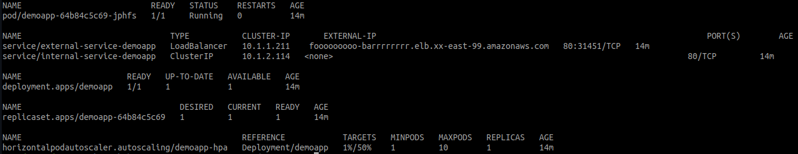

# kubernetes

<pre>
	All test were tested on kubernetes 1.20 (eks)
</pre>

#### Kubernetes deployment Best Practices 

Searching in kubernetes website and I selected the most common issues for create a "Best practices Deployment"

| Description | Status|
|-   |-       |
|Annotations | Ok |
|Container does not have any dangerous capabilities | Ok |
|Image tag is specified | Ok | 
|Image pull policy is "Always" | Ok |
|CPU requests are set | Ok |
|CPU limits are set | Ok |
|Memory limits are set | Ok |
|Memory requests are set | Ok |
|Filesystem is read only | Ok |
|Readiness probe is configured | Ok |
|Liveness probe is configured | Ok |
|Not allowed to run as root | Ok |
|No Host port is configured  | Ok |
|Privilege escalation not allowed | Ok |
|Not running as privileged | Ok |

 

 
	 

