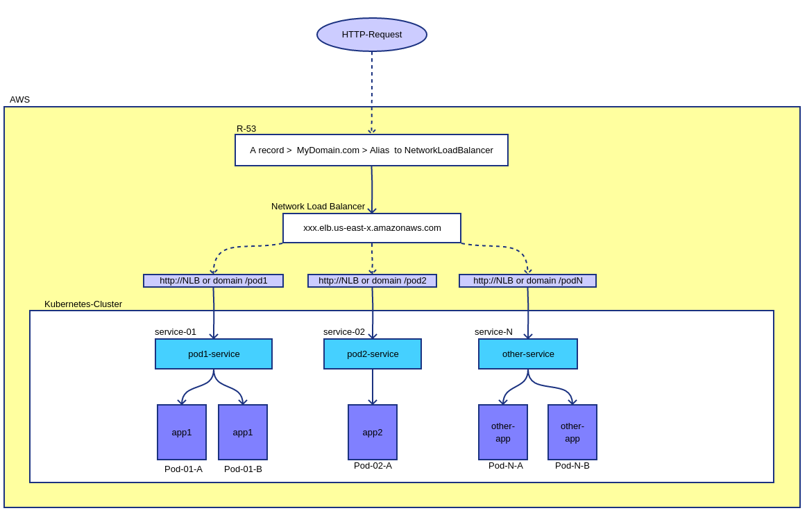

# Nginx Ingress Kubernetes

https://www.youtube.com/watch?v=80Ew_fsV4rM

<pre>
The idea is use only one load-balancer and a R53 domain to access all resources. 
This is interesting to avoid spend money in multiple LBs and maintain much more simplicity administration
Olso, you have only one domain to acces all your service
Example: 
 - domain.com/pod1 
 - domain.com /pod2  
 - domain.com/grafana  
 - domain.com/foobar
</pre>

 

 
<pre>
NAME                                         READY   STATUS      RESTARTS   AGE
pod/demoingress-admission-create-b5bd7       0/1     Completed   0          138m
pod/demoingress-admission-patch-dbqbl        0/1     Completed   0          138m
pod/demoingress-controller-b457c58dc-gc6h9   1/1     Running     0          138m
pod/pod1-app                                 1/1     Running     0          16m
pod/pod2-app                                 1/1     Running     0          16m
pod/pod3-grafana-758bbcfc69-pnmvw            1/1     Running     0          16m

NAME                                       TYPE           CLUSTER-IP       EXTERNAL-IP                                                                     PORT(S)                      AGE
service/demoingress-controller             LoadBalancer   1.1.1.1    xxx.elb.us-x.amazonaws.com   80:30817/TCP,443:31149/TCP   138m
service/demoingress-controller-admission   ClusterIP      2.2.2.2    none                         443/TCP                      138m
service/pod1-service                       ClusterIP      3.3.3.3    none                         5678/TCP                     16m
service/pod2-service                       ClusterIP      4.4.4.4    none                         5678/TCP                     16m
service/pod3-grafana-service               ClusterIP      5.5.5.5    none                         80/TCP                       16m

NAME                                     READY   UP-TO-DATE   AVAILABLE   AGE
deployment.apps/demoingress-controller   1/1     1            1           138m

NAME                                               DESIRED   CURRENT   READY   AGE
replicaset.apps/demoingress-controller-b457c58dc   1         1         1       138m

NAME                                     COMPLETIONS   DURATION   AGE
job.batch/demoingress-admission-create   1/1           3s         138m
job.batch/demoingress-admission-patch    1/1           2s         138m
</pre>

 
